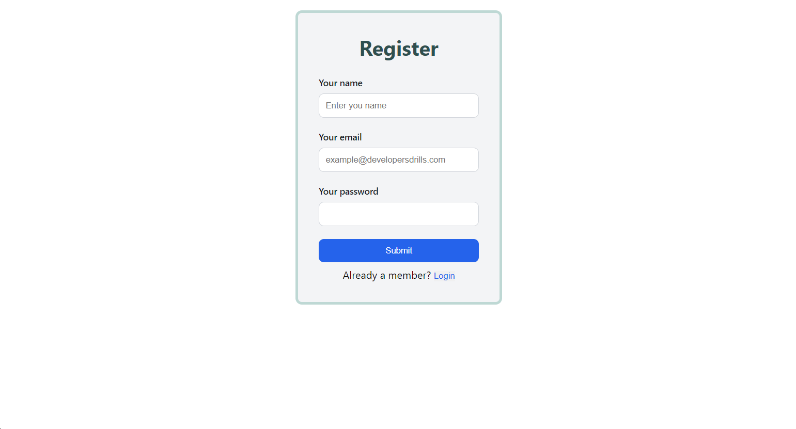
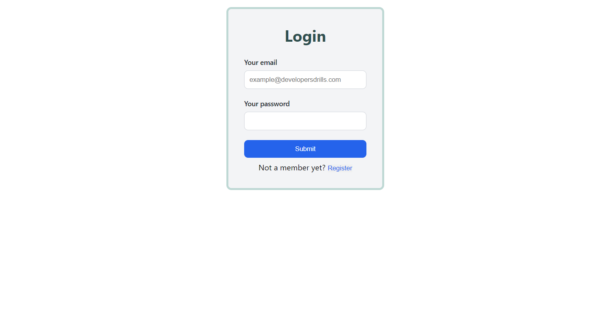
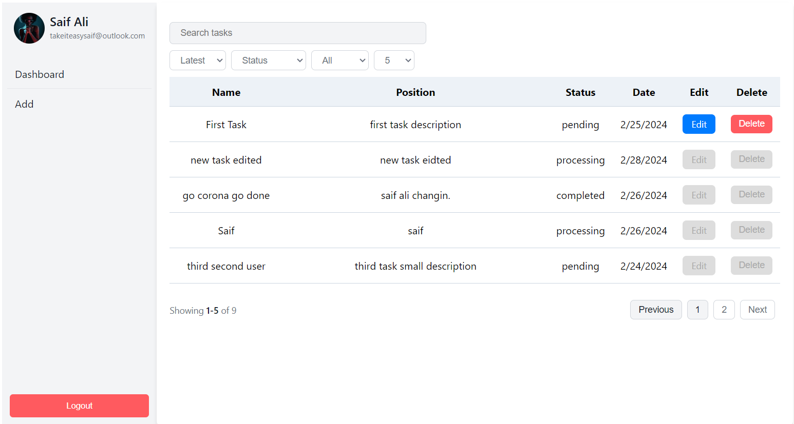
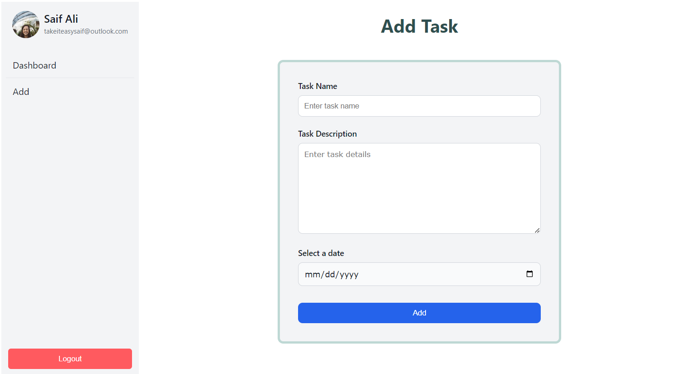
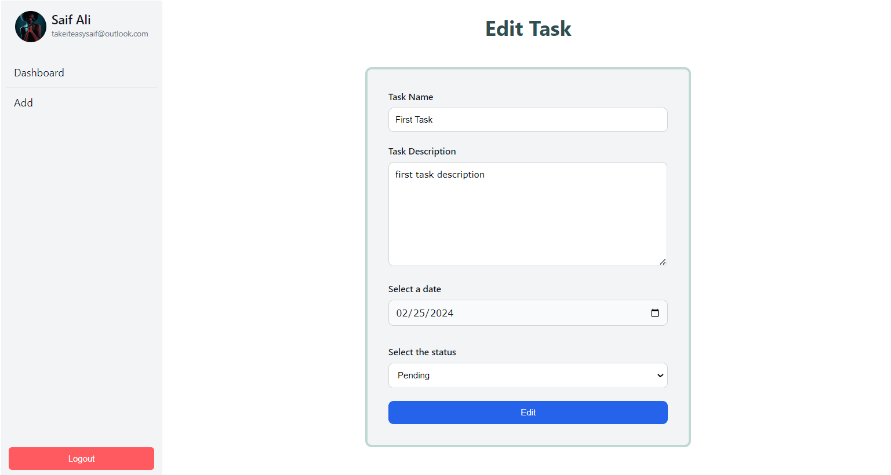

# MERN Stack Developer [Live](https://task-management-application-hazel.vercel.app)

## Task Management Application

### Overview:

- This task management application is built using the MERN stack, which comprises MongoDB for data storage, Node.js and Express.js for the backend, and React.js for the frontend. The application allows users to create, update, delete, and view tasks. Authentication functionality is also implemented to ensure secure access to the application.

### Pictures

#### Register

#### Login

#### Dashboard

#### Add Task

#### Edit Task

### Features:

1. Authentication:

   - Users can sign up with a unique username and password.
   - Secure login and logout functionality is provided.

2. Task Management:

   - Authenticated users can create tasks with a title, description, and due date.
   - Users can view a list of their tasks.
   - CRUD operations (Create, Read, Update, Delete) are available for tasks.

3. Database:

   - MongoDB is used for storing user information and tasks.

4. Backend:

   - Node.js and Express.js handle the server-side logic.
   - RESTful APIs are implemented for CRUD operations on tasks.

5. Frontend:

   - React.js is utilized for building the frontend.
   - Components are developed for tasks display, creation, and editing, as well as for authentication forms.
   - React Router enables navigation between different pages.

6. State Management:

   - State management libraries Redux is employed to manage application state.

7. Styling:

   - Style the application using CSS.
   - Implement responsive design.

8. Advanced Features:
   - Add search/filter according to title, status, latest, only your or alls functionality for tasks.
   - Implement pagination for tasks.
